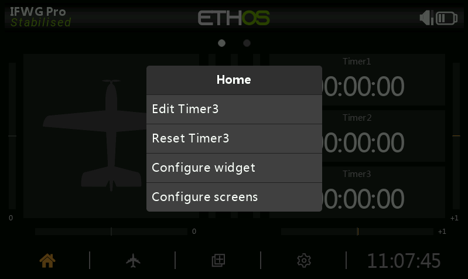
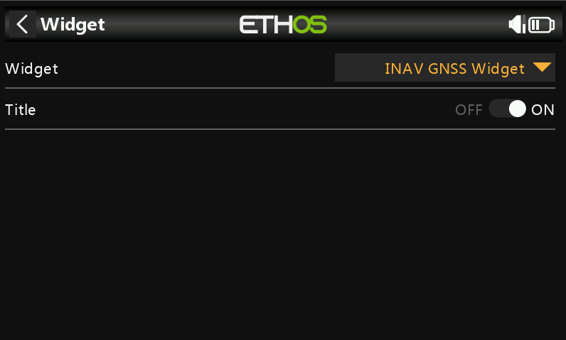
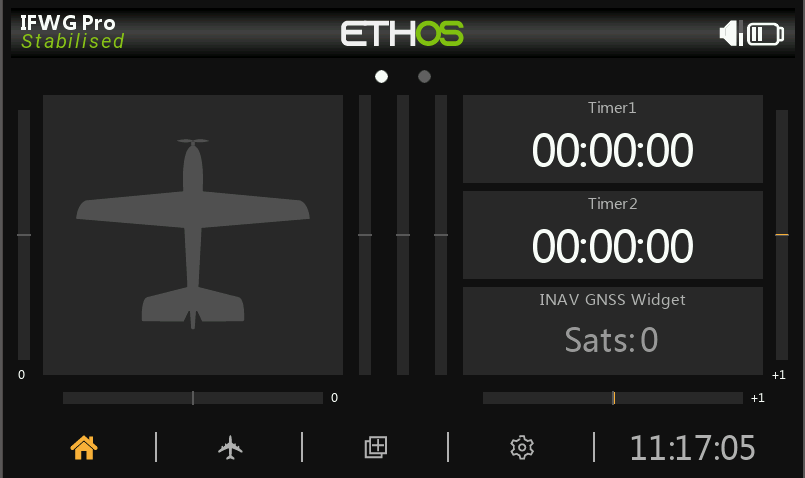

# ETHOS GNSS display widget for INAV
This ETHOS widget shows the number of satellite fixes, sent via telemetry from INAV. It will work with both CRSF and SmartPort/FPORT/FBUS telemetry. 

## Installation
Simply copy the `scripts` folder to the root folder of your transmitters MicroSD card or flash drive. Depending on which transmitter you have, and how it is setup.

If your transmitter has a **Storage location** section in the **System** > **General** menu. You can select if the `scripts` folder is located on the MicroSD card or on the transmitter's flash storage. If not, it will be on the MicroSD card. The only transmitters at this time without flash storage are the X20, X20S, and X20 HD.

## How to use
You should already have the telemetry sensors from INAV discovered. If not, you will need to discover them. To do this, go to the **Model** menu and open the **Telemetry** option. Before enabling **Discover new sensors**. Make sure that your flight controller is powered, the receiver is bound to the transmitter, and that the GNSS module has power. After enabling **Discover new sensors**. The list should be populated with the sensors from the receiver and INAV.

The next step is to add the widget. You can either do this by setting up a new widget page in the **Screens** menu. Or modify an existing widget on the home screen. Seeing as the home screen has 3 timers. I'll show how to modify one of those. 

First, select the widget that you want to change. Click the **enter** button, and select **Configure widget**.

Next, select **INAV GNSS Widget** from the **Widget** list.

That's it. All done.

### What you see

If all the sensor are correctly installed. You will probably see the above screen. If not, you will see a message saying **No GNSS Sensor found**. If you see this message, the widget can't find one of the accepted GNSS sensors. So try the Telemetry sensor discovery again. Making sure that the GNSS module has power. 

The main display is the number of satellites that have a fix. The colour of the satellite count will change to give an idea of if the aircraft is ready to fly. If the colour is grey, the sensor is not receiving data.

#### SmartPort/FPORT/FBUS
Through these telemetry systems. There is actually a flag for the aircraft being ready to fly. So this widget displays different colours for the readiness status.
- $${\color{red}Red}$$ is used when there is no 3D fix with the minimum satellites
- $${\color{orange}Orange}$$ is used when there is a 3D fix with the minimum satellites
- $${\color{green}Green}$$ is used when there is a home fix

The sensors used are `480` in INAV 8.0 or above and `Tmp2` in older versions.

#### CRSF
With CRSF, all we have is the number satellite fixes. So we can only estimate the readiness status.
- $${\color{red}Red}$$ is used when there are less than 6 satellite fixes
- $${\color{orange}Orange}$$ is used when there are 6 or more satellite fixes

The sensor used is `GPS Sats`.

## Known issues
Currently, the GNSS telemetry sensor seems to stop updating when using FrSky telemetry. I've not investigated yet, so don't know if this is an issue with ETHOS or INAV. I have also not tested this on CRSF.